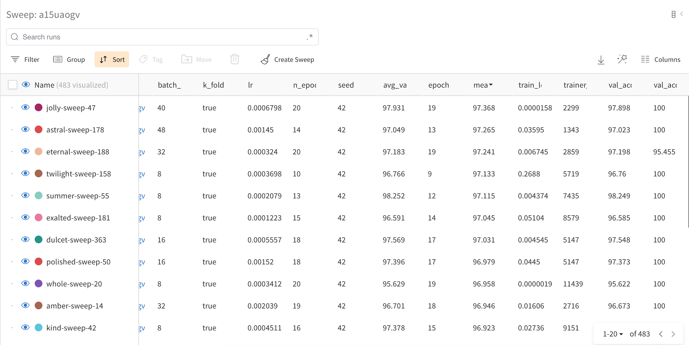
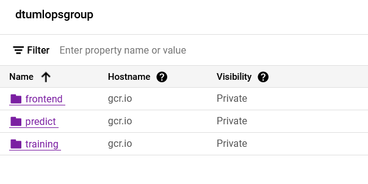
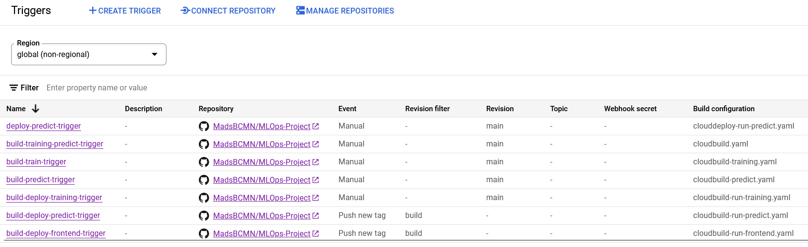

# Exam template for 02476 Machine Learning Operations

This is the report template for the exam. Please only remove the text formatted as with three dashes in front and behind
like:

```--- question 1 fill here ---```

where you instead should add your answers. Any other changes may have unwanted consequences when your report is auto
generated in the end of the course. For questions where you are asked to include images, start by adding the image to
the `figures` subfolder (please only use `.png`, `.jpg` or `.jpeg`) and then add the following code in your answer:

```markdown

```

In addition to this markdown file, we also provide the `report.py` script that provides two utility functions:

Running:

```bash
python report.py html
```

will generate an `.html` page of your report. After deadline for answering this template, we will autoscrape
everything in this `reports` folder and then use this utility to generate an `.html` page that will be your serve
as your final handin.

Running

```bash
python report.py check
```

will check your answers in this template against the constrains listed for each question e.g. is your answer too
short, too long, have you included an image when asked to.

For both functions to work it is important that you do not rename anything. The script have two dependencies that can
be installed with `pip install click markdown`.

## Overall project checklist

The checklist is *exhaustic* which means that it includes everything that you could possible do on the project in
relation the curricilum in this course. Therefore, we do not expect at all that you have checked of all boxes at the
end of the project.

### Week 1

* [ ] Create a git repository
* [ ] Make sure that all team members have write access to the github repository
* [ ] Create a dedicated environment for you project to keep track of your packages
* [ ] Create the initial file structure using cookiecutter
* [ ] Fill out the `make_dataset.py` file such that it downloads whatever data you need and
* [ ] Add a model file and a training script and get that running
* [ ] Remember to fill out the `requirements.txt` file with whatever dependencies that you are using
* [ ] Remember to comply with good coding practices (`pep8`) while doing the project
* [ ] Do a bit of code typing and remember to document essential parts of your code
* [ ] Setup version control for your data or part of your data
* [ ] Construct one or multiple docker files for your code
* [ ] Build the docker files locally and make sure they work as intended
* [ ] Write one or multiple configurations files for your experiments
* [ ] Used Hydra to load the configurations and manage your hyperparameters
* [ ] When you have something that works somewhat, remember at some point to to some profiling and see if
      you can optimize your code
* [ ] Use Weights & Biases to log training progress and other important metrics/artifacts in your code. Additionally,
      consider running a hyperparameter optimization sweep.
* [ ] Use Pytorch-lightning (if applicable) to reduce the amount of boilerplate in your code

### Week 2

* [ ] Write unit tests related to the data part of your code
* [ ] Write unit tests related to model construction and or model training
* [ ] Calculate the coverage.
* [ ] Get some continuous integration running on the github repository
* [ ] Create a data storage in GCP Bucket for you data and preferable link this with your data version control setup
* [ ] Create a trigger workflow for automatically building your docker images
* [ ] Get your model training in GCP using either the Engine or Vertex AI
* [ ] Create a FastAPI application that can do inference using your model
* [ ] If applicable, consider deploying the model locally using torchserve
* [ ] Deploy your model in GCP using either Functions or Run as the backend

### Week 3

* [ ] Check how robust your model is towards data drifting
* [ ] Setup monitoring for the system telemetry of your deployed model
* [ ] Setup monitoring for the performance of your deployed model
* [ ] If applicable, play around with distributed data loading
* [ ] If applicable, play around with distributed model training
* [ ] Play around with quantization, compilation and pruning for you trained models to increase inference speed

### Additional

* [ ] Revisit your initial project description. Did the project turn out as you wanted?
* [ ] Make sure all group members have a understanding about all parts of the project
* [ ] Uploaded all your code to github

## Group information

### Question 1
> **Enter the group number you signed up on <learn.inside.dtu.dk>**
>
> Answer:

--- 34 ---

### Question 2
> **Enter the study number for each member in the group**
>
> Example:
>
> *sXXXXXX, sXXXXXX, sXXXXXX *
>
> Answer:

--- s194665, s194663, s184208 ---

### Question 3
> **What framework did you choose to work with and did it help you complete the project?**
>
> Answer length: 100-200 words.
>
> Example:
> *We used the third-party framework ... in our project. We used functionality ... and functionality ... from the*
> *package to do ... and ... in our project*.
>
> Answer:

--- We have chosen to use the TIMM (PyTorch Image Models) framework for our image classification project. Specifically, we used the ResNet-18 architecture from TIMM. The extensive collection of pre-trained models in TIMM made it easy to experiment with different architectures without building them from scratch. TIMM is used to facilitate the development of our deep learning model and streamline the process of creating a finetuned model based on the ResNet-18 architecture with a modified output layer. In addition, we saw the advantages of the TIMM framework as it converges faster during training compared to a model we tested without using TIMM. ---

## Coding environment

> In the following section we are interested in learning more about you local development environment.

### Question 4

> **Explain how you managed dependencies in your project? Explain the process a new team member would have to go**
> **through to get an exact copy of your environment.**
>
> Answer length: 100-200 words
>
> Example:
> *We used ... for managing our dependencies. The list of dependencies was auto-generated using ... . To get a*
> *complete copy of our development environment, one would have to run the following commands*
>
> Answer:

--- We managed dependencies using a dedicated environment and the requirements.txt file. To replicate our environment, a new team member must create a virtual environment, install the required packages listed in requirements.txt using the pip install -r requirements.txt command, and activate the virtual environment. Additionally, they should clone the project repository using git clone https://github.com/MadsBCMN/MLOps-Project, navigate to the project directory with cd MLOps-Project, and then pull the data files using Data Version Control (DVC) with dvc pull. This ensures that the team member has the correct Python packages installed and retrieves the necessary data files. We used Hydra for configuration management, ensuring that hyperparameters and configurations were easily accessible and modifiable. To test the model for other hyperparameters, new team members can, e.g., utilize the python train_model.py lr=1e-3 override command, replacing the hyperparameter values as needed.  ---

### Question 5

> **We expect that you initialized your project using the cookiecutter template. Explain the overall structure of your**
> **code. Did you fill out every folder or only a subset?**
>
> Answer length: 100-200 words
>
> Example:
> *From the cookiecutter template we have filled out the ... , ... and ... folder. We have removed the ... folder*
> *because we did not use any ... in our project. We have added an ... folder that contains ... for running our*
> *experiments.*
> Answer:

--- From the cookiecutter template, we filled  The "src" folder contains the main source code, including data handling, model implementation, visualization, an training and prediction script. We used the folders "data" and "output" to store the data and output from the source code. We utilized the "config" folder for managing configurations with Hydra, making hyperparameter tuning and configuration adjustments. The "tests" folder includes unit tests of the data and model components. We did not fill out the notebooks folder, and we created three new folders wandb, dockerfiles and app. wandb contains log files for runs of weights and bias, dockerfiles contains all our docker files in one place, and app contains our main.py script for our application. DVC is used to manage the following folders: "models" for trained model, "profiler" profiling logs from pytorch profiler, "data/raw" with the raw images and "data/processed" contains the processed data. ---

### Question 6

> **Did you implement any rules for code quality and format? Additionally, explain with your own words why these**
> **concepts matters in larger projects.**
>
> Answer length: 50-100 words.
>
> Answer:

--- We complied with PEP8 coding standards for code quality and format using global variables, docstring comments, typing, and informative comments. Consistent coding standards are essential to improve readability, maintainability, and collaboration in larger projects. They promote a consistent style, making it easier for others to understand and contribute. Adhering to good code quality also makes controlling and automating debugging easier. ---

## Version control

> In the following section we are interested in how version control was used in your project during development to
> corporate and increase the quality of your code.

### Question 7

> **How many tests did you implement and what are they testing in your code?**
>
> Answer length: 50-100 words.
>
> Example:
> *In total we have implemented X tests. Primarily we are testing ... and ... as these the most critical parts of our*
> *application but also ... .*
>
> Answer:

--- In total, we have implemented two tests for our project. These tests primarily focus on testing the correct data loading and model prediction functionality. The test_data function tests the data loading and preprocessing pipeline. It checks whether the number of training and test tensors matches the number of corresponding images, validates the shapes of the tensors, and ensures that the labels are correct. The test_model function, on the other hand, assesses the correctness of the model's output shape by feeding random input data into the loaded model and comparing the output shape with the expected shape of (1,4) for four categories. ---

### Question 8

> **What is the total code coverage (in percentage) of your code? If you code had an code coverage of 100% (or close**
> **to), would you still trust it to be error free? Explain you reasoning.**
>
> Answer length: 100-200 words.
>
> Example:
> *The total code coverage of code is X%, which includes all our source code. We are far from 100% coverage of our **
> *code and even if we were then...*
>
> Answer:

--- The total code coverage of our project is 100%. This means that all of the code in our project has been executed at least once during testing. While 100% code coverage does not guarantee error-free code, it can increase the likelihood of detecting and fixing bugs early in development. Therefore, we can still not trust the code to be error free or work as intended as it does not cover aspects like logical errors or incorrect business logic. ---


### Question 9

> **Did you workflow include using branches and pull requests? If yes, explain how. If not, explain how branches and**
> **pull request can help improve version control.**
>
> Answer length: 100-200 words.
>
> Example:
> *We made use of both branches and PRs in our project. In our group, each member had an branch that they worked on in*
> *addition to the main branch. To merge code we ...*
>
> Answer:

--- Yes, our workflow included using branches and pull requests to some extent. We often worked together on the project or in different files, so using different branches was only sometimes necessary. When we worked independently, each team member had their own branch for working on new features or bug fixes. Before merging the code into the main branch, we would create a pull request that other team members could review and comment on. This process helped to ensure that all changes were well-tested and documented before being integrated into the main code.
*** NOTE REVISIT *** ---

### Question 10

> **Did you use DVC for managing data in your project? If yes, then how did it improve your project to have version**
> **control of your data. If no, explain a case where it would be beneficial to have version control of your data.**
>
> Answer length: 100-200 words.
>
> Example:
> *We did make use of DVC in the following way: ... . In the end it helped us in ... for controlling ... part of our*
> *pipeline*
>
> Answer:

--- Yes, we did use DVC to manage data in our project. DVC is a data version control tool that allows us to track and store the different versions of our data, ensuring that we can reproduce our results and compare different iterations of our models. We primarily used dvc as a more optimal data learning solution rather than storing the 7GB in our github repository.
*** NOTE REVISIT ***  ---


### Question 11

> **Discuss you continues integration setup. What kind of CI are you running (unittesting, linting, etc.)? Do you test**
> **multiple operating systems, python version etc. Do you make use of caching? Feel free to insert a link to one of**
> **your github actions workflow.**
>
> Answer length: 200-300 words.
>
> Example:
> *We have organized our CI into 3 separate files: one for doing ..., one for running ... testing and one for running*
> *... . In particular for our ..., we used ... .An example of a triggered workflow can be seen here: <weblink>*
>
> Answer:

--- We have implemented a continuous integration (CI) workflow using GitHub Actions. In our continuous integration setup, we've structured the CI pipeline into a single workflow named "Run tests." This workflow automatically runs unit tests whenever a change is pushed to the repository. It also ensures the project builds and runs correctly on multiple operating systems and Python versions. The dependencies, including project dependencies and test requirements specified in requirements.txt and requirements_tests.txt, are cached for faster subsequent runs using GitHub Actions' caching mechanism. The DVC cache is also cached separately, enhancing the efficiency of data retrieval during testing. The CI workflow includes testing with pytest to validate the code's functionality. This ensures that unit tests are executed, providing feedback on the correctness of the codebase. ---

## Running code and tracking experiments

> In the following section we are interested in learning more about the experimental setup for running your code and
> especially the reproducibility of your experiments.

### Question 12

> **How did you configure experiments? Did you make use of config files? Explain with coding examples of how you would**
> **run a experiment.**
>
> Answer length: 50-100 words.
>
> Example:
> *We used a simple argparser, that worked in the following way: python my_script.py --lr 1e-3 --batch_size 25*
>
> Answer:

--- Yes, we ensured reconfigurability and reproducibility by employing config files for experiments. We utilized multiple configuration files to test different variables and scenarios (see exp1.yaml and exp2.yaml). we also used argparser to do quick tests along the way, looking like this: python your_script.py --lr 0.0005 --batch_size 40 --n_epochs 20 --seed 42 --k_fold --profile. Finally, we did a parameter sweep approach to systematically explore various hyperparameter combinations and find the most optimal hyperparameter. We tested 12 images with our prediction application and with the hyperparameters found with sweep and all 12 images were classified correctly.  ---

### Question 13

> **Reproducibility of experiments are important. Related to the last question, how did you secure that no information**
> **is lost when running experiments and that your experiments are reproducible?**
>
> Answer length: 100-200 words.
>
> Example:
> *We made use of config files. Whenever an experiment is run the following happens: ... . To reproduce an experiment*
> *one would have to do ...*
>
> Answer:

--- To ensure reproducibility, we used the logging module to log configuration parameters, such as learning rate, batch size, number of epochs and seed which are logged at different steps in the script. An overview of the experimental setup is saved, and this way, we could always go back and reproduce an experiment by going to the log file src/outputs/, which provides an overview of the configuration and details of the training and evaluation phases. ---

### Question 14

> **Upload 1 to 3 screenshots that show the experiments that you have done in W&B (or another experiment tracking**
> **service of your choice). This may include loss graphs, logged images, hyperparameter sweeps etc. You can take**
> **inspiration from [this figure](figures/wandb.png). Explain what metrics you are tracking and why they are**
> **important.**
>
> Answer length: 200-300 words + 1 to 3 screenshots.
>
> Example:
> *As seen in the first image when have tracked ... and ... which both inform us about ... in our experiments.*
> *As seen in the second image we are also tracking ... and ...*
>
> Answer:

---
We utilized Weights & Biases (W&B) to monitor and visualize key metrics for our experiments to enhance our model performance. Here are three screenshots showcasing different aspects of our experiments:




In the first screenshot, we see the table of the sweep table runs sorted according to mean_val_accuracy. The second image shows a dashboard of all the performance, where we can compare all runs, or just selected runs. The last image shows the performance of the metrics we are currently using in our model. Let's take a closer look at the last image. We tracked various metrics during our experiments, including train loss, validation accuracy per epoch, validation accuracy per training step, epoch, and average validation accuracy. Train loss is a metric that indicates how well the model learns during the training process. Monitoring the validation accuracy per epoch helps us understand the overall performance trends across training iterations. Validation accuracy per training step provides a more detailed overview, allowing us to detect potential overfitting or rapid improvements. Epoch and average validation accuracy are crucial metrics to assess the overall effectiveness of our model. A good indicator that these are suitable parameters for our model is if train_loss is the inverse of avg_los_accuracy, as seen for jolly-sweep-47 in the last image. ---

### Question 15

> **Docker is an important tool for creating containerized applications. Explain how you used docker in your**
> **experiments? Include how you would run your docker images and include a link to one of your docker files.**
>
> Answer length: 100-200 words.
>
> Example:
> *For our project we developed several images: one for training, inference and deployment. For example to run the*
> *training docker image: `docker run trainer:latest lr=1e-3 batch_size=64`. Link to docker file: <weblink>*
>
> Answer:

--- For our project, Docker played a role in creating containerized applications for various stages of our workflow. We developed several Docker images to encapsulate different components of our pipeline, including training, inference, and deployment. For example, for the training, this ensures that the training process is consistent and reproducible across different environments. To build our docker image for our API, we used:

docker build -t my_app.

And to build the container, we used:

docker run --name appcontainer -p 80:80 my_app

Here is the link to one of our Dockerfiles:
[Dockerfile](https://github.com/MadsBCMN/MLOps-Project/blob/main/dockerfiles/predict-cloud.dockerfile)

***NOTE REVISIT*** ---

### Question 16

> **When running into bugs while trying to run your experiments, how did you perform debugging? Additionally, did you**
> **try to profile your code or do you think it is already perfect?**
>
> Answer length: 100-200 words.
>
> Example:
> *Debugging method was dependent on group member. Some just used ... and others used ... . We did a single profiling*
> *run of our main code at some point that showed ...*
>
> Answer:

---When we encountered errors during our experiments, we used a combination of debugging methods, both traditional debugging techniques with print statements and step-by-step inspection of the code to identify issues, as well as using debugging tools such as profilers. We performed a single profiling run using cProfile on our main code to understand the runtime behavior of different features and methods. We used it to answer questions about the performance of our code, such as how often each method was called and how much time each method spent.---

## Working in the cloud

> In the following section we would like to know more about your experience when developing in the cloud.

### Question 17

> **List all the GCP services that you made use of in your project and shortly explain what each service does?**
>
> Answer length: 50-200 words.
>
> Example:
> *We used the following two services: Engine and Bucket. Engine is used for... and Bucket is used for...*
>
> Answer:

--- We used GCP Bucket for data storage and integrated it with our data version control system. It facilitates efficient data management. We created a trigger workflow in Cloud Build to build Docker images automatically. This automates the process, streamlines the deployment pipeline, and ensures consistency and reliability. Additionally, we deployed our FastAPI application for model inference using either Cloud Functions, which enables us to scale our API based on demand and ensure optimal performance.
Monitoring?
Vertex Ai?
**NOTE REVISIT** ---

### Question 18

> **The backbone of GCP is the Compute engine. Explained how you made use of this service and what type of VMs**
> **you used?**
>
> Answer length: 100-200 words.
>
> Example:
> *We used the compute engine to run our ... . We used instances with the following hardware: ... and we started the*
> *using a custom container: ...*
>
> Answer:

--- question 18 fill here ---

### Question 19

> **Insert 1-2 images of your GCP bucket, such that we can see what data you have stored in it.**
> **You can take inspiration from [this figure](figures/bucket.png).**
>
> Answer:

---  ---

### Question 20

> **Upload one image of your GCP container registry, such that we can see the different images that you have stored.**
> **You can take inspiration from [this figure](figures/registry.png).**
>
> Answer:

---   ---

### Question 21

> **Upload one image of your GCP cloud build history, so we can see the history of the images that have been build in**
> **your project. You can take inspiration from [this figure](figures/build.png).**
>
> Answer:

--- 
  ---

### Question 22

> **Did you manage to deploy your model, either in locally or cloud? If not, describe why. If yes, describe how and**
> **preferably how you invoke your deployed service?**
>
> Answer length: 100-200 words.
>
> Example:
> *For deployment we wrapped our model into application using ... . We first tried locally serving the model, which*
> *worked. Afterwards we deployed it in the cloud, using ... . To invoke the service an user would call*
> *`curl -X POST -F "file=@file.json"<weburl>`*
>
> Answer:

--- For deployment, we made our image classification model into a FastAPI application. Initially, we tested the deployment locally, ensuring the service was operational on our machines, and then we used Google Cloud Platform (GCP) for deployment.
Users can make a POST request to the /classify endpoint to invoke the deployed service. For example, using the curl command:
bashCopy code:

curl -X POST -F "file=@/path/file.jpg" http://127.0.0.1:8000/classify

This command sends an image file (file.jpg) to the deployed FastAPI application for classification. The service then processes the image, predicts its class, and returns the result in JSON format.  ---

### Question 23

> **Did you manage to implement monitoring of your deployed model? If yes, explain how it works. If not, explain how**
> **monitoring would help the longevity of your application.**
>
> Answer length: 100-200 words.
>
> Example:
> *We did not manage to implement monitoring. We would like to have monitoring implemented such that over time we could*
> *measure ... and ... that would inform us about this ... behaviour of our application.*
>
> Answer:

--- question 23 fill here ---

### Question 24

> **How many credits did you end up using during the project and what service was most expensive?**
>
> Answer length: 25-100 words.
>
> Example:
> *Group member 1 used ..., Group member 2 used ..., in total ... credits was spend during development. The service*
> *costing the most was ... due to ...*
>
> Answer:

--- question 24 fill here ---

## Overall discussion of project

> In the following section we would like you to think about the general structure of your project.

### Question 25

> **Include a figure that describes the overall architecture of your system and what services that you make use of.**
> **You can take inspiration from [this figure](figures/overview.png). Additionally in your own words, explain the**
> **overall steps in figure.**
>
> Answer length: 200-400 words
>
> Example:
>
> *The starting point of the diagram is our local setup, where we integrated ... and ... and ... into our code.*
> *Whenever we commit code and puch to github, it auto triggers ... and ... . From there the diagram shows ...*
>
> Answer:

--- question 25 fill here ---

### Question 26

> **Discuss the overall struggles of the project. Where did you spend most time and what did you do to overcome these**
> **challenges?**
>
> Answer length: 200-400 words.
>
> Example:
> *The biggest challenges in the project was using ... tool to do ... . The reason for this was ...*
>
> Answer:

--- question 26 fill here ---

### Question 27

> **State the individual contributions of each team member. This is required information from DTU, because we need to**
> **make sure all members contributed actively to the project**
>
> Answer length: 50-200 words.
>
> Example:
> *Student sXXXXXX was in charge of developing of setting up the initial cookie cutter project and developing of the*
> *docker containers for training our applications.*
> *Student sXXXXXX was in charge of training our models in the cloud and deploying them afterwards.*
> *All members contributed to code by...*
>
> Answer:

--- question 27 fill here ---
